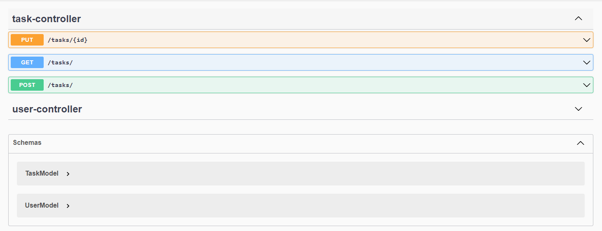

# 📋 To Do List - Rocketseat
> Construção back-end de uma aplicação de To-Do List

## ✔️ Status do Projeto
> 🚧 Em construção...  🚧

## Features

- [x] Cadastro de Usuário
- [x] Cadastro de tarefas
- [x] Listagem de tarefas
- [x] Atualização de tarefas
- [x] Realizado Deploy no Render

## Routes

## 🛠️ Tecnologias Utilizadas

- spring initialzr
- spring-boot-starter-web
- spring-boot-starter-data-jpa
- springdoc-openapi-starter-webmvc-ui
- lombok
- h2